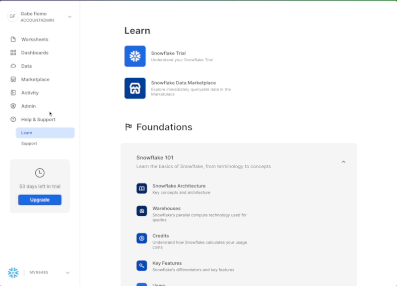
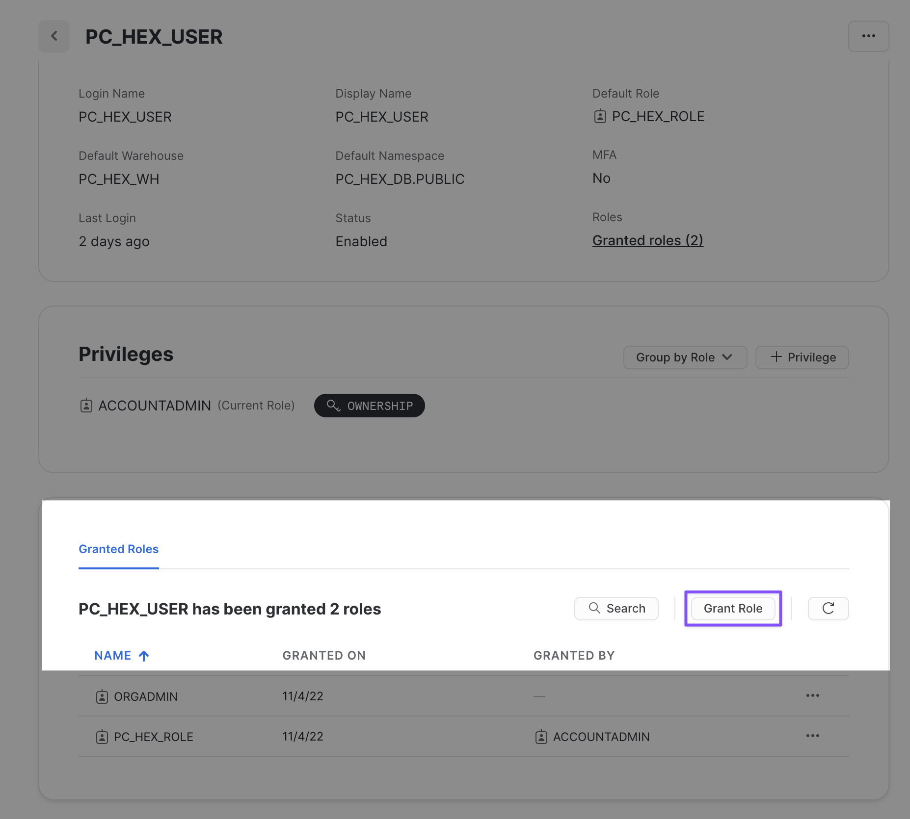
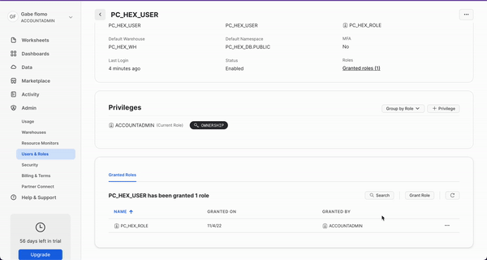
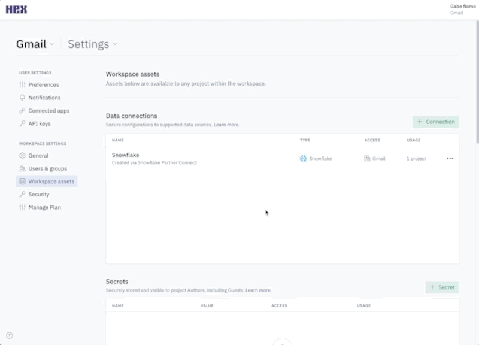

author: miles.adkins@snowflake.com
id: hex
summary: This lab will walk you through how to use Snowflake and Hex.
categories: Getting Started
environments: web
status: Published
feedback link: https://github.com/Snowflake-Labs/sfguides/issues
tags: Hex, Notebooks, Partner Connect

# Building and deploying a time series forecasts with Hex + Snowflake

<!-- ------------------------ -->
## Lab Overview 
Duration: 5

{use case / lab overview}

Hex is a platform for doing collaborative data science and analytics in Python, SQL, and No-code. In this guide, you will be introduced to the basics of using Hex in collaboration with Snowflake/Snowpark to build a data science project. It is designed specifically for use with the [Snowflake free 30-day trial](https://trial.snowflake.com), and a Hex trial account via Snowflake’s Partner Connect.

This lab will walk you through the process of creating a forecasting model to predict the hourly foot traffic for various restaurants. We will then take our trained model and deploy it to Snowflake through the use of a User-Defined Table Function or UDTF. Once our function is 

### Prerequisites
- Familiarity with basic Python and SQL 
- Familiarity with training ML models
- Familiarity with data science notebooks

### What You'll Learn
- Use Snowflake’s “Partner Connect” to seamlessly create a Hex trial

### What You’ll Need
- A [Snowflake](https://signup.snowflake.com/) Account (if you are using an enterprise account through your organization, it is unlikely that you will have the privileges to use the `ACCOUNTADMIN` role, which is required for this lab).

### What You’ll Build
An end-to-end Machine Learning pipeline to forecast hourly traffic for a restaurant chain using Hex, Snowflake, Snowpark, and XGBoost.

This pipeline will:
- Generate the hourly restaurant data used for training the model
- Write your data back to Snowflake using [writeback cells](https://learn.hex.tech/docs/logic-cell-types/writeback-cells)
- Train an XGBoost forecasting model
- Deploy the trained model as a UDTF
- Use the model to make predictions on future data

<!-- ------------------------ -->
## Connecting Snowflake with Hex
Duration: 5

At this point in time, we have our data sitting in an optimized table within Snowflake that is available for a variety of different downstream functions. Snowflake does not offer notebook capabilities, and therefore, happily partners with the leading cloud notebook  partners in the industry.

Once you've logged into your Snowflake account, you'll land on the `Learn` page. Simply navigate to the `Admin` tab on the left and click `Partner connect`. In the search bar at the top, type in `Hex`, and you should see the Hex partner connect tile appear. Clicking on the tile will bring up a connection screen, and all that's required is to press the connect button in the lower right corner. This will bring you to a new screen saying that your account has been created and from here you can click `Activate`.

Once activated, you'll be brought to a Hex screen asking you what you'd like to name your Hex workspace *(you can choose whatever name you like)*. Once you've created your workspace, head back over to Snowflake and navigate to the `Admin` tab again but this time select `Users & roles`. From here, you should see 3 users with one of them being named `PC_HEX_USER`. This is the user that was created when you activated Hex with partner connect. We'll need to activate the `ORGADMIN` role for this user. Select `PC_HEX_USER`, and at the bottom of the page you'll see a section to grant new roles.

Click on grant role, which will open a window to grant roles to the `PC_HEX_USER` account. In the `Role to grant` dropdown, you'll see the role `ORGADMIN`. Select this role and then click `Grant`. This will activate the role for you and we'll come back to this later.

### Configuring the Snowflake data connection in Hex
Next, we'll need to tweak the configurations of our data connection a bit. Head over to Hex, click on `Projects` and then navigate to the  `Settings` page. On the left side of the screen, you'll see a section called `Workspace settings` with the subcategory `Workspace assets`, this is where we can edit our data connection settings. 

Inside of the Workspace assets page, you'll see your data connections at the top with a Snowflake data connection created by partner connect. You can configure the connection settings by clicking the 3-dot menu and selecting edit. 

Inside of the data connection configuration page, we'll change 3 things
* Remove `.snowflakecomputing.com` from the Account name.
* Turn `Proxy` off.
* Enable [`Writeback`](https://learn.hex.tech/docs/logic-cell-types/writeback-cells) functionality.

The last thing we'll want to do is accept the [Anaconda terms and conditions enabled by the ORGADMIN](https://docs.snowflake.com/en/developer-guide/udf/python/udf-python-packages.html#using-third-party-packages-from-anaconda) role we granted ourselves access to earlier. To do this, navigate back to Snowflake and click on your username in the top left corner. You'll see a section that will allow you to switch to the ORGADMIN role. Once switched over, navigate to the `Admin` tab and select `Billing & Terms`. From here, you will see a section that will allow to accept the anaconda terms and conditions which is required for a later step in our project.

<!-- ------------------------ -->
## Getting Started with Hex
Duration: 10

Now we can move back over to Hex and get started on our project. The first thing you'll need to do is download the Hex project that contains all of the code for generating our data and training our model.

<button>

[Download Hex project](assets/Forecasting-Traffic.yaml)

</button>

Once downloaded, head over to Hex and you'll see a button to import a project in the upper right corner. Select `import` and upload the file that we just downloaded above.  

Now that you've got your project imported, you will find yourself in the [Logic view](https://learn.hex.tech/docs/develop-logic/logic-view-overview) of a Hex project. On the far left side, you'll see a control panel that will allow you to do things like upload files, import data connections, or search your project. Before we dive into the code, we'll need to:
1. Change our compute profile to run Python 3.8
2. Import our Snowflake data connection

Which we can do all from the left control panel. To change the compute profile, click on the Environments tab represented by a cube, at the top of this section you'll see the compute profile portion at the top. CLick on the `Image` dropdown and select Python 3.8. 

Next we can import our Snowflake data connection by heading over to the `Data sources` tab represented by a database icon with a lightning bolt. At the bottom of this section, you'll see a portion that says available workspace connections and you should see one that says Snowflake. Once you import this connection, all the setup steps will be completed and you can dive into the project. 

