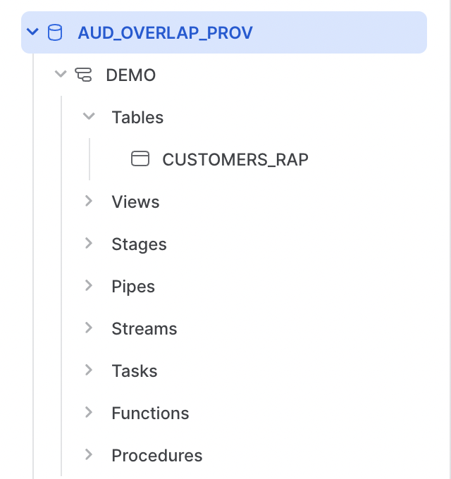

author: Rachel Blum, Jim Warner
id: secure_audience_overlaps
summary: This Quickstart shows how to do a simple audience overlap with a partner before setting up a more permanent clean room.
categories: Getting Started
environments: web
status: Hidden
feedback link: https://github.com/Snowflake-Labs/sfguides/issues
tags: Getting Started, AdTech

# Simple and Secure Audience Overlaps
<!-- ------------------------ -->
## Overview 
Duration: 1

Many customers use a [Data Clean Room (DCR)](https://quickstarts.snowflake.com/guide/build_a_data_clean_room_in_snowflake/index.html) built on Snowflake to collaborate with partners in a secure manner.  However, before they do, they often want to see if a clean room is worthwhile.  To understand whether two partners are a good fit for each other, it may make sense for them to understand the size of the overlap of their customer base or audiences.

In this guide, we will show how two Snowflake accounts can measure the size of their overlap securely, without setting up a full data clean room.

### What You’ll Learn 
- How to perform a secure audience overlap using data sharing

### What You’ll Need 
- Access to two Snowflake accounts in the same region

### What You’ll Build 
- SQL statements to generate example data
- A data share
- SQL statements to perform the overlap

<!-- ------------------------ -->
## Provider account set-up
Duration: 2

The first step is to set up the provider account, with the first customer data set.

### Account set up
Run the following to create the warehouse, database, and schema to store the demo customer data.

```sql
use role accountadmin;
CREATE WAREHOUSE AUD_OVERLAP_DEMO_WH WITH WAREHOUSE_SIZE='XSmall'  STATEMENT_TIMEOUT_IN_SECONDS=15    STATEMENT_QUEUED_TIMEOUT_IN_SECONDS=15;
USE WAREHOUSE AUD_OVERLAP_DEMO_WH;
CREATE DATABASE AUD_OVERLAP_DEMO;
CREATE SCHEMA AUD_OVERLAP_DEMO.DEMO;
```

### Data generation
Next, we create a table with test data.

```sql
USE AUD_OVERLAP_DEMO.DEMO;
CREATE OR REPLACE TABLE customers_rap AS
SELECT 'user'||seq4()||'_'||uniform(1, 3, random(1))||'@email.com' as email,
 replace(to_varchar(seq4() % 999, '000') ||'-'||to_varchar(seq4() % 888, '000')||'-'||to_varchar(seq4() % 777, '000')||uniform(1, 10, random(2)),' ','') as phone,
  case when uniform(1,10,random(3))>3 then 'MEMBER'
       when uniform(1,10,random(4))>5 then 'SILVER'
       when uniform(1,10,random(5))>7 then 'GOLD'
else 'PLATINUM' end as status,
round(18+uniform(0,10,random(6))+uniform(0,50,random(7)),-1)+5*uniform(0,1,random(8)) as age_band
  FROM table(generator(rowcount => 1000000));
```

We can verify the data by running the following.

```sql
SELECT * FROM customers_rap;
```

## Consumer account set-up
Duration: 3

Similar to the provider account, we need to set up the consumer account and similarly create data.

### Account set up
Run the following to create the warehouse, database, and schema to store the demo customer data.

```sql
use role accountadmin;
CREATE WAREHOUSE AUD_CONSUMER_DEMO_WH WITH WAREHOUSE_SIZE='XSmall'  STATEMENT_TIMEOUT_IN_SECONDS=15    STATEMENT_QUEUED_TIMEOUT_IN_SECONDS=15;
USE WAREHOUSE AUD_CONSUMER_DEMO_WH;
CREATE DATABASE AUD_CONSUMER_DEMO;
CREATE SCHEMA AUD_CONSUMER_DEMO.DEMO;
```

### Data generation
We want to create another customer table.  It will also have email addresses, and we want those emails to overlap sometimes, but not all of the time.  In addition, we want the schema of the table to be a bit different.

```sql
// create table with sample data
USE AUD_CONSUMER_DEMO.DEMO;
CREATE OR REPLACE TABLE customers as
SELECT 'user'||seq4()||'_'||uniform(1, 3, random(2))||'@email.com' as email,
 ,sha1(uniform(1, 1000000, random(3)))::varchar(40) as user_id
FROM table(generator(rowcount => 1000000));
```

We can verify the data by running the following.

```sql
SELECT * FROM customers;
```

## Provider share set-up
The provider wants to share their customer list with the consumer, but only to count the rows.

### Create the row access policy
In order to prevent leaking data when we create the share, we will first create a row access policy.  Run the following.

```sql
CREATE OR REPLACE ROW ACCESS POLICY agg_rap AS (email varchar) returns boolean ->
    current_role() IN ('ACCOUNTADMIN')
      or (current_statement()='select count(distinct c.email) from AUD_OVERLAP_PROV.DEMO.CUSTOMERS_RAP r
 inner join AUD_CONSUMER_DEMO.DEMO.CUSTOMERS c on c.email=r.email;' );
--apply row access policy
alter table customers_rap add row access policy agg_rap on (email);
```

Notice we have to be very specific about the way the share is mounted in the allowed SQL, so the consumer must follow these directions specifically.

### Create the share
Next, we share the table with the consumer account.  For this, you will need the ID of the consumer account.

```sql
CREATE SHARE audience_overlap;
grant usage on database AUD_OVERLAP_DEMO to share audience_overlap;
grant usage on schema AUD_OVERLAP_DEMO.DEMO to share audience_overlap;
grant select on AUD_OVERLAP_DEMO.DEMO.customers_rap to share audience_overlap;
alter share audience_overlap add accounts=<account id of consumer here>;
```

You can check to make sure the correct grants were make to the share as follows.

```sql
show grants to share audience_overlap;
```

## Consumer share set-up and querying
Duration: 2

The consumer must mount the share, and then can query the data.

### Mounting the share
To see what shares are available, the consumer can run the following.

```sql
show shares;
```

The name column should show the share created in the other count, ending in AUDIENCE_OVERLAP.  Copy and paste that share name, and mount it as follows.

```sql
CREATE DATABASE AUD_OVERLAP_PROV FROM SHARE <account info>.AUDIENCE_OVERLAP;
```

If you are using Snowsight, on the left you will now see the database mounted.  If you open to the table section, you will see the CUSTOMERS_RAP table available.



### Querying the shared data
Try running the following to look at the shared data.

```sql
select * from AUD_OVERLAP_PROV.DEMO.CUSTOMERS_RAP r;
select * from AUD_OVERLAP_PROV.DEMO.CUSTOMERS_RAP r
 inner join AUD_CONSUMER_DEMO.DEMO.CUSTOMERS c on c.email=r.email;
```

Because these SQL statements are not allowed by the row access policy, both return no rows.  Now try the following.

```sql
select count(distinct c.email) from AUD_OVERLAP_PROV.DEMO.CUSTOMERS_RAP r
 inner join AUD_CONSUMER_DEMO.DEMO.CUSTOMERS c on c.email=r.email;
```

Because this is the only SQL statement allowed by the row access policy, this statement works, returning a count of 332,912.

<!-- ------------------------ -->
## Conclusion
Duration: 1

Clean rooms are a powerful tool for collaboration between multiple parties in Snowflake.  However, many organizations may want to test an overlap before committing to a full-fledged clean room relationships.  Fortunately, using row level access policies and data sharing, this is possible in Snowflake today.

### What we've covered
- Creating test data
- Creating a row level access policy
- Creating a share
- Mounting the share and querying the shared data